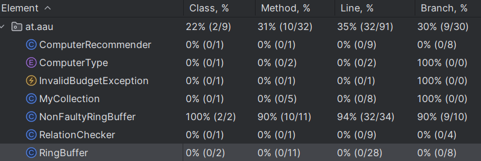

## The following documents some of the potential bugs in RingBuffer class implementation

- the constructor doesn't check the capacity for larger than zero, meaning the user can input non-positive value for the
  capacity.
- Another possible logical error, is that the iterator starts at index 0, regardless of where the start of the ring
  buffer is, which is ok as long as the buffer hasn't wrapped around, but once it has, the iterator will not return the
  elements in the correct order.

## Test coverage


<br>
I had to fix the RingBuffer class to make it pass all the tests in order to get test coverage. As seen, it has **90%**
branch coverage.

In order to achieve 100% branch coverage, the following is the last missing test case, which checks the hasNext() method in case the Buffer is fully consumed, so it should return false.:

```java
@Test
void iteratorHasNextTest() {
    NonFaultyRingBuffer<Integer> ring = new NonFaultyRingBuffer<>(3);
    ring.push(1);
    ring.push(2);
    ring.push(3);

    Iterator<Integer> it = ring.iterator();
    assertEquals(1, it.next());
    assertEquals(2, it.next());
    assertEquals(3, it.next());
    assertFalse(it.hasNext());

    assertThrows(java.util.NoSuchElementException.class, it::next);
}
```

Now it has 100% branch coverage:

