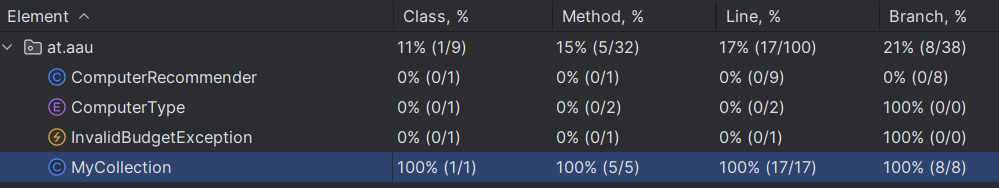

**Initial tests coverage:**


Adding the following edge-case tests increased coverage to 100%:

```java

@Test
void removeFromEmptyTest() {
    MyCollection coll = new MyCollection(1);
    assertThrows(IllegalArgumentException.class, () -> coll.remove("y"));
}

@Test
void removeNonExistentTest() {
    MyCollection coll = new MyCollection(1);
    coll.add("x");
    assertThrows(IllegalArgumentException.class, () -> coll.remove("y"));
}
```

as follows:
